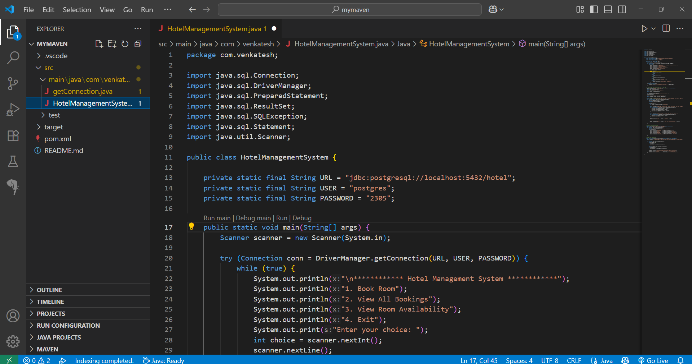

##******** Hotel Management System ********##

The Hotel Management System is a simple console-based application developed using Core Java, JDBC, and PostgreSQL. It is designed for Admin use only to manage hotel room bookings.  
Admins can book AC/Non-AC rooms, view customer bookings, and check room availability summaries.  

---

# Features

- Book multiple rooms (AC or Non-AC) for customers
- View all customer bookings
- View room availability summary
- Simple and menu-driven console UI
- Works with PostgreSQL database using JDBC

---

# Technologies Used

- **Java 17 or 17+**
- **PostgreSQL 15+**
- **JDBC 4.2**
- **Apache Maven 3.8.6+**

---

# Maven Dependency

Add the following to your `pom.xml`:

```xml
<dependency>
    <groupId>org.postgresql</groupId>
    <artifactId>postgresql</artifactId>
    <version>42.7.7</version>
</dependency>
```

---

# Prerequisites

- **Make sure the following are installed on your system:**

- **Java JDK 17 or newer**
- **pache Maven 3.8.6 or newer**
- **PostgreSQL 15 or newer**

---

# Database Setup
```sql

 **Step 1: Create a Database**

 CREATE DATABASE hotel;

 **Step 2: Create Tables**

 1 . CREATE TABLE rooms (
    room_number INT PRIMARY KEY,
    room_type VARCHAR(10) NOT NULL CHECK (room_type IN ('AC', 'NON-AC')),
    is_booked BOOLEAN DEFAULT FALSE
);

 2 .  CREATE TABLE customers (
    id SERIAL PRIMARY KEY,
    name VARCHAR(100) NOT NULL,
    contact VARCHAR(20) NOT NULL,
    room_number INT REFERENCES rooms(room_number),
    room_type VARCHAR(10) NOT NULL
);

 **Step 3: Insert Rooms (50 AC and 50 Non-AC)**

 ** Insert 50 AC rooms (1 to 50)
INSERT INTO rooms (room_number, room_type) 
SELECT generate_series(1, 50), 'AC';

 ** Insert 50 Non-AC rooms (51 to 100)
INSERT INTO rooms (room_number, room_type) 
SELECT generate_series(51, 100), 'NON-AC';

```

--- 

# Project Structure

```bash
com/venkatesh/
├── HotelManagementSystem.java  # Main application class with all logic
```

---

# How to Run

- *Clone or download this project.*
- *Open it using VS Code, IntelliJ, or Eclipse.*
- *Edit your DB credentials in HotelManagementSystem.java:*
- **private static final String URL = "jdbc:postgresql://localhost:5432/hotel";*
- *private static final String USER = "postgres";*
- *private static final String PASSWORD = "2305";*
- *mvn clean install*
- *Run HotelManagementSystem.java to start the application.*

---

# Hotel Management System 

- 1. Book Room
- 2. View All Bookings
- 3. View Room Availability Summary
- 4. Exit
Enter your choice:

---

# Contact

- **Developer:** Venkatesh Soma
- **Email:** venkateshsoma2305@gmail.com
- **GitHub:** venkatesh-soma 

---

# Screenshot :





