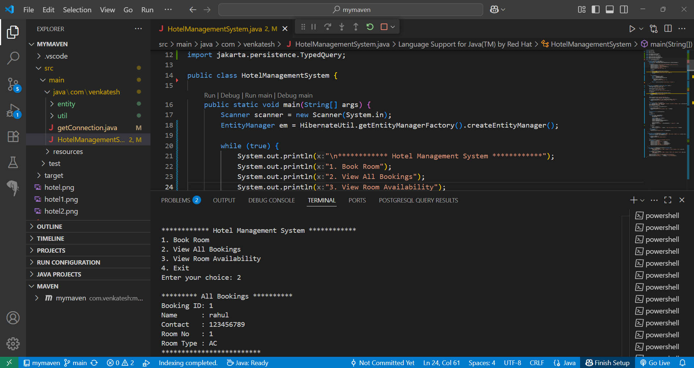

##******  Hotel Management System  ******##

The Hotel Management System is a console-based Java application built using Core Java, Hibernate JPA, and PostgreSQL. It allows hotel administrators to book rooms, view all bookings, and check room availability in real-time. The system supports AC and Non-AC rooms, and ensures clean data handling using JPA and multithreaded-friendly structure.

---

# Features
- Book AC or Non-AC rooms
- View all customer bookings
- Check live room availability summary
- Hibernate JPA integration with PostgreSQL
- Input validation and meaningful console feedback
- Clean structure with Entity, Utility, and Main classes
- Maven-based build system

---

# Technologies Used 
- **Java 17+**
- **PostgreSQL 15+**
- **Hibernate ORM 7.0.5.Final**
- **Jakarta Persistence 3.2.0**
- **Apache Maven 3.8.6+**

---

# Dependency 

Add the following to your `pom.xml`:

```xml
<dependencies>
    <dependency>
        <groupId>org.hibernate.orm</groupId>
        <artifactId>hibernate-core</artifactId>
        <version>7.0.5.Final</version>
    </dependency>
    <dependency>
        <groupId>jakarta.persistence</groupId>
        <artifactId>jakarta.persistence-api</artifactId>
        <version>3.2.0</version>
    </dependency>
    <dependency>
        <groupId>org.postgresql</groupId>
        <artifactId>postgresql</artifactId>
        <version>42.7.7</version>
    </dependency>
</dependencies>

```

---

#  JPA Configuration (persistence.xml) 
- Location: src/main/resources/META-INF/persistence.xml

```xml
<?xml version="1.0" encoding="UTF-8"?>
<persistence xmlns="https://jakarta.ee/xml/ns/persistence" version="3.0">
  <persistence-unit name="hotel-unit" transaction-type="RESOURCE_LOCAL">
    <class>com.venkatesh.entity.Room</class>
    <class>com.venkatesh.entity.Customer</class>
    <properties>
      <property name="jakarta.persistence.jdbc.url" value="jdbc:postgresql://localhost:5432/hotel"/>
      <property name="jakarta.persistence.jdbc.user" value="postgres"/>
      <property name="jakarta.persistence.jdbc.password" value="yourpassword"/>
      <property name="jakarta.persistence.jdbc.driver" value="org.postgresql.Driver"/>
      <property name="hibernate.dialect" value="org.hibernate.dialect.PostgreSQLDialect"/>
      <property name="hibernate.hbm2ddl.auto" value="update"/>
      <property name="hibernate.show_sql" value="false"/>
    </properties>
  </persistence-unit>
</persistence>

```

---

# Prerequisites
- Ensure the following are installed:
- Java JDK 17 or 17+
- Apache Maven 3.8.6+
- PostgreSQL 15+


---

# Database Setup 
```sql

 **Step 1: Create a Database**

 CREATE DATABASE hotel;

 **Step 2: Create Tables**

CREATE TABLE rooms (
  room_number INTEGER PRIMARY KEY,
  room_type VARCHAR(10),
  is_booked BOOLEAN
);

CREATE TABLE customers (
  id SERIAL PRIMARY KEY,
  name VARCHAR(100),
  contact VARCHAR(20),
  room_number INTEGER,
  room_type VARCHAR(10)
);

 **Step 3: Insert Rooms (50 AC and 50 Non-AC)**

 ** Insert 50 AC rooms (1 to 50)
INSERT INTO rooms (room_number, room_type) 
SELECT generate_series(1, 50), 'AC';

 ** Insert 50 Non-AC rooms (51 to 100)
INSERT INTO rooms (room_number, room_type) 
SELECT generate_series(51, 100), 'NON-AC';

```

--- 

# Project Structure 

```bash
src/
└── com/
    └── venkatesh/
        ├── HotelManagementSystem.java
        ├── entity/
        │   ├── Room.java
        │   └── Customer.java
        ├── service/
        │   ├── BookingService.java
        │   └── ViewService.java
        └── util/
            └── HibernateUtil.java

```

---

# How to Run 

- *Clone the repo or download the ZIP.*
- *Open the project in VS Code, IntelliJ, or Eclipse.*
- *Make sure PostgreSQL is running and the hotel database is created.*
- *Update DB credentials in persistence.xml under:*
1. *property name="jakarta.persistence.jdbc.user" value="postgres"*
2. *property name="jakarta.persistence.jdbc.password" value="yourpassword"*
- *Open terminal and run: mvn clean install*
- *Run HotelManagementSystem.java*

---

# Hotel Management System :

- 1. Book Room
- 2. View All Bookings
- 3. View Room Availability Summary
- 4. Exit 
-     Enter your choice:

---

# Input Validations 
- Field	Validation
- Name Cannot be empty
- Contact	Cannot be empty
- Room Type	Must be "AC" or "Non-AC"
- Room Count Must be a valid integer > 0

--- 

# Contact 

- **Developer:** Venkatesh Soma
- **Email:** venkateshsoma2305@gmail.com
- **GitHub:** venkatesh-soma 

---

# Screenshot :





